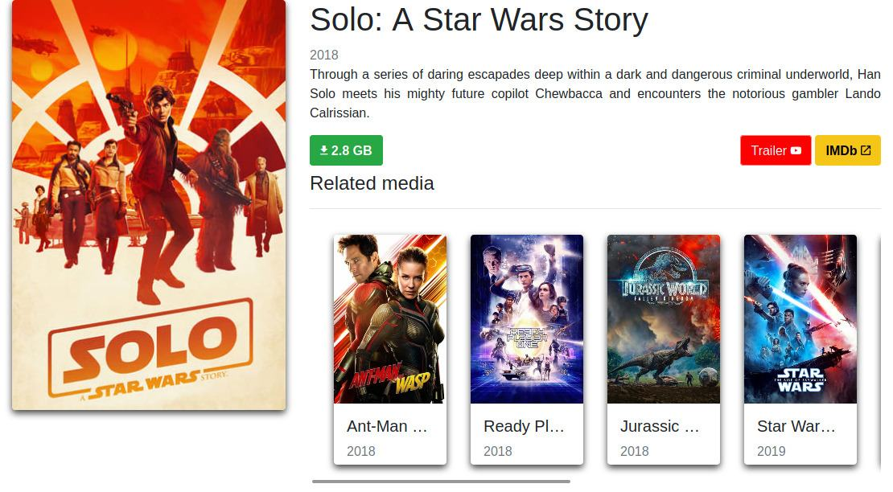
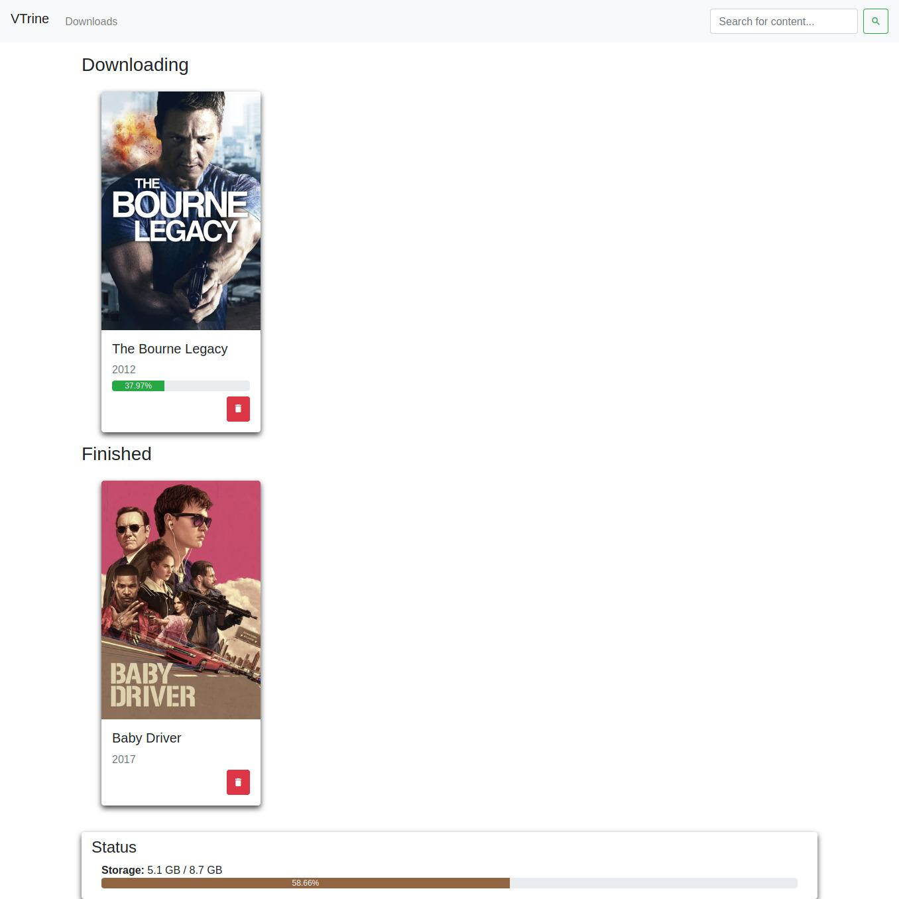

# Vtrine

## Download movies. TV shows. That Simple.

Vtrine is a software that searches for torrents and presents information about media in a beautiful and simple way.

It integrates with a bittorrent client and doesn't reinvent the wheel. At the moment we support:

 - Deluge
 - Transmission

It is small, and fits well in a HTPC, serving as a menu of media to watch.

